# What is PINN (PINN Is Not NOOBS)?

**An easy enhanced Operating System installer for the Raspberry Pi**

The latest version of [PINN](http://downloads.sourceforge.net/projects/pinn/pinn-lite.zip) can be downloaded from [sourceforge](http://www.sourceforge.net/projects/pinn).

This README relates to v3.5.3

<sup>(PINN-lite does not include any operating systems at all. It is more akin to `NOOBS-lite` rather than `NOOBS`. For that reason, the filename that you download is called `pinn-lite.zip`. More recently, `pinn.zip` has also been made available for download which includes versions of Raspbian and LibreELEC.)</sup>

## Index

* [Quick Start](#quick-start)
* [PINN User Interface](#pinn-user-interface)
* [PINN Configuration](#pinn-configuration)
* [Installing OSes](#installing-oses)
* [Booting an OS with PINN](#booting-an-os-with-pinn)
* [Other Features](#other-features)
* [Archival Menu](#archival-menu)
* [Maintenance Menu](#maintenance-menu)
* [Advanced Usage](#advanced-usage)
* [Troubleshooting](#troubleshooting)
* [FAQ](#faq)
* [How to Rebuild PINN](#how-to-rebuild-pinn)

# Introduction

## Features
- A multi Operating System (OS) installer
- An operating system selector
- A boot manager
- An OS maintenance utility:
  - Backup and Restore OSes
  - A recovery shell 
  - SD card clone utility
  - Password restorer
  - File System Checker

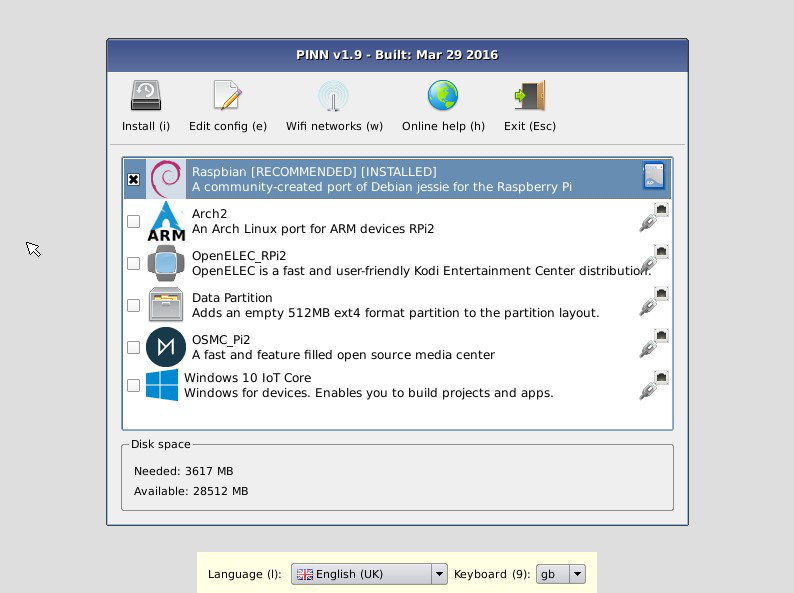

<sup>*NOTE: The list of OSes in this image is indicative only. It will vary according to your Raspberry Pi model and the availability of OSes on the installation sources.</sup>

## Benefits

PINN is designed to make it easy to select and install operating systems for the Raspberry Pi without having to worry about manually imaging your SD card. 

Once PINN is installed on your SD card, the installation of other OSes and a lot of the maintenance of them can mostly be done on the RPi itself without having to remove the SD card.

The list of OSes that can be installed by PINN is growing all the time, from general purpose Linux distros, through educational versions, media centres to retro gaming solutions. It is the ideal environment to experiment and try out new OSes.

PINN occupies just over 60MB of your precious SD card space, leaving the majority of the  card available for your OSes.

### General Operation

On first boot, PINN will format your SD card and allow you to select which OSes you want to install from a list. This OS list is automatically generated from locally available OSes (i.e. those contained in the `/os` directory on disk or an attached USB memory stick) and those available from a remote repository (network connection required).

Only the latest version of each OS will ever be displayed. So, you can be sure that you have installed the most up-to-date release of your selected OS.

On any subsequent boot, you can press the SHIFT key to enter the PINN interface and easily reinstall your choice of OSes. It is also possible to press the Left mouse button, press any key on a CEC enabled TV remote, or touch the Raspberry logo on the touchscreen to enter the PINN interface.

If no input is provided, PINN will proceed to the boot selection dialog. If only one OS installed it will booted immediately, otherwise a menu of installed OSes will be presented for one to be selected. If no choice is detected within a timeout period, the last booted OS, or a default OS will be chosen. 

It is also possible for PINN to be bypassed altogether and one of the OSes booted directly from startup. In this way it is not even noticeable that PINN is there, but it can be reinstated simply by deleting a single file on the PINN partition.

## Requirements

- A Raspberry Pi with power supply (works with all models)
- A blank micro SD card (or SD card for an earlier Model 1 RPi). 8GB is the minimum recommended size. 16GB or larger is preferred, especially if you want to install locally from the SD card.
- (optional) A keyboard and mouse (unless you want to use it headlessly).
- (recommended) A network connection (unless you want to install OSes from a local source, but you'll need to download them somehow first!).
- (recommended) A USB uSD card reader is not required, but it is an essential bit of kit to allow a PC to format the uSD card, install PINN initially and general editing if something goes wrong.
- Access to NOOBS formatted OS distributions (via Internet or local memory device).
- [pinn-lite.zip](http://downloads.sourceforge.net/projects/pinn/pinn-lite.zip).

---
# Quick Start

The following Quick Start instructions detail the most common and quickest way to start using PINN. For more details on the other features that PINN provides, please continue reading the rest of this document.

## Format your SD card as FAT32

For **Windows** users, we recommend formatting your SD card using the SD Association's Formatting Tool, which can be downloaded from https://www.sdcard.org/downloads/formatter_4/ .
If you are still using v4 of this tool, you will need to set the "FORMAT SIZE ADJUSTMENT" option to "ON" in the "Options" menu to ensure that the entire SD card volume is formatted - not just a single partition. However, this tool has now been upgraded to v5 where this feature is now the default and is no longer selectable. For more detailed and beginner-friendly formatting instructions, please refer to http://www.raspberrypi.org/quick-start-guide .

The SD Association's Formatting Tool is also available for <b>Mac</b> users. However, note that the default OSX Disk Utility is also capable of formatting the entire disk (select the SD card volume and choose "Erase" with "MS-DOS" format).

For **Linux** users, we recommend `gparted` (or the command line version `parted`). (Update: Norman Dunbar has written up the following formatting instructions for Linux users: http://qdosmsq.dunbar-it.co.uk/blog/2013/06/NOOBS-for-raspberry-pi/)

## Copy the PINN files to your SD card.

- Download **[pinn-lite.zip](http://sourceforge.net/projects/pinn/files/pinn-lite.zip)** from [sourceforge](http://www.sourceforge.net/projects/pinn)
- Extract the files from pinn-lite.zip file onto the SD card. (Windows built-in zip features may have trouble with this file. If so, use another program such as 7zip.) **In some cases, the files may be extracted into a folder. If this is the case, please copy the files from inside the folder rather than copying the folder itself.**

## Using Etcher

An alternative to unzipping the pinn-lite.zip file to a FAT32 formatted drive is to use the popular Etcher program 
to burn an image directly to the SD card.

The [pinn-lite.img.zip](http://sourceforge.net/projects/pinn/files/Etcher/pinn-lite.img.zip) image file you need to burn can be found on [sourceforge](http://www.sourceforge.net/projects/pinn) in the Etcher folder.

## Boot PINN on your PI

- Put the PINN SD card into your Pi and boot it.
- On first boot the "RECOVERY" FAT partition will be automatically resized to a minimum, so if you ever put your SD card back into a Windows machine it will look like a very small partition. THIS IS NORMAL.
- PINN does not come supplied with any OSes. You must download them from the internet or provide them on a USB stick. So,....
- Connect your Pi to the internet with an Ethernet cable (easiest)
- Or If you prefer to use Wifi, click on the wifi button and select your SSID and password. If the wifi button is greyed out, choose another type of wifi dongle.
- A list of OSes that are available to install will be displayed.
- Select one or more OSes that you want and click INSTALL.

## Self Update

If PINN is connected to the Internet, it will check for the latest version available for download from the recovery main menu. If a newer version is available, a dialog box will pop up, showing the latest version number and the recent changes. You then have the option to cancel the update, download it, or ignore this version.

If you cancel the update, the dialog box will keep popping up to remind you each time PINN starts.

If you select "ignore", this version will be ignored and no dialogs will pop up again until another later version is released.

If you choose to download this update, the zip file will be downloaded and will overwrite your current version of PINN. PINN will then reboot the RPi and restart PINN.

It is possible to disable self-update checks by adding the `no_update` option to `recovery.cmdline`. In this case you will have to delete this option to enable self-updates again. Or you can manually check for updates at any time by choosing to `reinstall` the PINN item in the archival menu, but it must be the only item selected.

You can force new updates to be automatically installed without user interaction by adding the `forceupdatepinn` to `recovery.cmdline`.

---

# PINN User Interface

The PINN user interface is kept fairly simple, comprising a switchable toolbar of command buttons, a list of installable operating systems and a status window indicating the capacity of appropriate attached memory devices. At the bottom of the screen is a small display customisation dialog that permits changing the language and keyboard layout of the user interface. The model of RPi you are using is also displayed just above this,

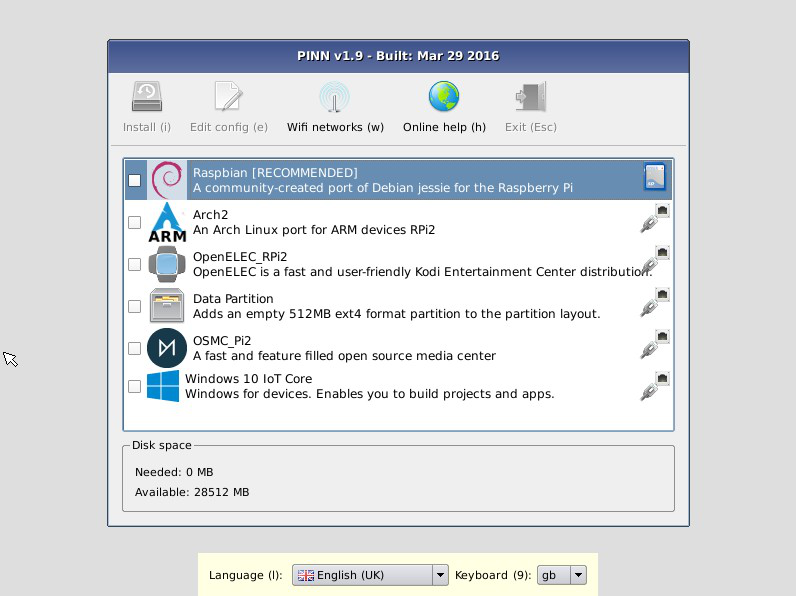

## Toolbars

There are three toolbars:

- **[Main Menu](#main-os-list-window)**
  - **[Install](#installing-oses)**: Installs the selected OSes onto your SD card. Changing this selection erases all OSes that are currently installed.
  - **[Wifi](#wireless-wifi-networks)**: configures the wifi.
  - **[Help](#online-help-via-web-browser)**: [Networking Required] Opens a browser that displays the Raspberry Pi Help page (http://www.raspberrypi.org/help/), allowing people to quickly access help and troubleshooting information.
  - **[Info](#info-on-os)**: [Networking Required] Opens a browser that displays the webpage for the selected OS.
  - **[Clear](#clear)**: Clears all selected OSes from the available and installed OS lists.
  - **[Exit](#exit)**: Quits PINN and reboots the Pi into the OS boot menu.
- **[Archival](#archival-menu)**
  - **[Download](#download)**: Downloads an OS for offline installation.
  - **[Clone SD](#how-to-clone-an-sd-card)**: Clones the SD to another card.
  - **[Info](#info-on-os)**: [Networking Required] Opens a browser that displays the webpage for the selected OS.
  - **[Firmware](#pinns-firmware-upgradedowngrade)**: Upgrades or downgrades PINN's firmware for use on RPI3B+ or other models.
  - **[Time](#set-time)**: Sets the current time.
  - **[Reload Repos](reload-repos)**: Reload the OS distribution lists from the internet.
- **[Maintenance](#maintenance-menu)**
  - **[Edit Config](#easy-config-file-editor)**: Opens a text editor, allowing the `cmdline` and `config` files for the selected installed OS to be edited.
  - **[Password](#how-to-recover-from-a-lost-password)**: Allows the password of an OS to be restored or replaced.
  - **[Backup](#backup)**: Backup Operating Systems.
  - **[Fix](#how-to-fix-an-os)**: Performs repairs on file systems of the selected installed OSes.
  - **[Reinstall](#reinstall-individual-oses)**: Allows individual installed OSes to be reinstalled back to their original installation without affecting any of the other installed OSes.
  - **[Replace](#replace-individual-oses)**: Allows individual installed OSes to be replaced by other/different OSes without affecting any of the other installed OSes.
  - **[Info](#info-on-os)**: [Networking Required] Opens a browser that displays the webpage for the selected OS.
  - **[Alias](#alias)**: Renames an installed OS by assigning it an alias.

The `more` button can be used to cycle through the 3 toolbars. (shortcuts = M)

## Main OS List Window

Beneath the toolbar is the main list of Operating Systems which displays the name and a short description of each OS. At the right hand side is an icon indicating the source where the latest version will be installed from (Internet, SD card or USB drive).

OSes are grouped onto tabs which categorise the type of OS they are. This grouping includes the following categories: General, Media, Gaming, Education, Minimal & Utility. To avoid this grouping, specify **`no_group`** on recovery.cmdline and the OSes will all appear in one list.

Each OS has a checkbox at the left hand side to select whether it will be installed or not. When PINN is booted with OSes already installed, these OSes will normally have their checkbox automatically ticked (but see the `select` option) and their background will also be light green in colour, along with the word **[installed]** next to their name. Note that installed OSes may be selected in multiple tabs.

When the **Maintenance** toolbar is selected, this list will change to only show the list of OSes that are already installed, since the toolbar buttons are only relevent to installed OSes.

## Status Window

Below the main OS List Window is a status window indicating the capacity of appropriate attached memory devices.

On the **Main Menu**, this status window will show the space on the SD card that is available to install OSes, along with the amount of required space for the selected OSes. If a USB drive is inserted, a drop down selection box will appear to change the install device from the SD card to the USB device. You will be prompted to format the USB drive if it is not already formatted in the correct way for a PINN installation. The model of RPi you are using is shown in the bottom right corner of this status window.

On the **Archival** menu, this status window will change to show the amount of available and required space on the USB drive for downloading OSes to. Such a USB drive will only be selectable if it has an /os folder on its first partition to store OSes on.

On the **Maintenance** menu, this status window will not appear.

## Display Customisation

In addition to the toolbars, the following functionality is provided:
 - <b>Language Selection</b>: Allows you to select the language used for text display.
 - <b>Keyboard Layout Selection</b>: Allows you to select the keyboard layout to be used.
 - <b>Display Mode Selection</b>: By default, PINN will output over HDMI at your display's preferred resolution, even if no HDMI display is connected. If you do not see any output on your HDMI display or are using the composite output, press 1, 2, 3 or 4 on your keyboard to select HDMI preferred mode (1), HDMI safe mode (2), composite PAL mode (3), or composite NTSC mode (4), respectively.
 - <b>Font size</b>: Some rudimentary adjustment of the font size can be made using the +/- keys. (This can cause text to overflow, but this will be addressed in a later version).
 - <b>Background colour</b>: To change the background colour for the screen and most windows, add `background=r,g,b` to recovery.cmdline, where 0,0,0 is black and 255,255,255 is white.
 - <b>style</b>: The style of the windows display can be modified  by adding `style=motif/windows/platinum` to recovery.cmdline
 - <b>Wallpaper</b>: The background wallpaper of PINN can be changed by adding your own `wallpaper.jpg` or `wallpaper.png` file to PINN's recovery partition.
 - <b>wallpaper_resize</b>: A custom wallpaper can be resized to fill the entire desktop by adding this option.

Note that all user settings (language, keyboard layout, display mode) will persist between reboots and will also be automatically passed to the installed OSes. This means that if you can see the PINN interface on your display device, you should be able to see the OS CLI/GUI when it boots too.

## User Control

### Mouse & Keyboard

If you are using the RPi locally, the majority of the program can be used with a mouse alone, although a keyboard can make it easier. A keyboard is required to enter the wifi credentials if you want to connect to a network that way. A virtual keyboard is now provided, however, the wifi can be preconfigured to avoid even this use.

### CEC Control

PINN can be controlled with a TV remote, if the HDMI TV has CEC support.
The default CEC remote keys are mapped as follows:

To simulate a mouse the following keys are used:
- Cursor Up/Down/Left/Right - moves the mouse cursor in each direction
- Select - mouse click

For quicker selection, the following keys may be easier if supported by your model of TV:
- Channel Up - previous list item
- Channel Down - next list item
- PLAY key - Enter Key
- Exit Key - Escape
- 9 key - Changes the toolbar
- 1-8 keys - select the menu buttons numbered from left to right

Any of the above remote keys can be used instead of the keyboard shift key on startup to access the main menu.

**NOTE: CEC implementations vary between TV manufacturers. The above key mappings work on Samsung TVs supporting their Anynet+. Other TV brands may not work as well, but the mouse simulation is designed to work on most TVs.**

It is possible to program your own set of key mappings for your particular remote. 
To do this you should create a `cec_keys.json` file. 
See the [cec_keys.md](cec_keys.md) document on how to do this.
The default mappings are listed in the [wiki](https://github.com/procount/pinn/wiki/Default-CEC-Key-mappings-for-cec_keys.json).

### Joystick Control

PINN can be controlled with a USB Joystick or Gamepad that is compatibel with XBox style interfaces.
The default buttons are mapped as follows:

To simulate a mouse the following keys are used:
- DPAD Up/Down/Left/Right - moves the mouse cursor in each direction
- A - Left mouse click
- X - Escape

Any of the buttons can be used instead of the keyboard shift key on startup to access the main menu.

Some other buttons are mapped to the cursor keys, primarily for use with the [virtual keyboard](#virtual-keyboard)

It is possible to program your own set of key mappings for your particular remote. 
To do this you should create a `joy_keys.json` file. 
See the [joy_keys.md](joy_keys.md) document on how to do this.
The default mappings are listed in the [wiki](https://github.com/procount/pinn/wiki/Default-JOY-Key-mappings-for-joy_keys.json).

### Virtual Keyboard

A virtual keyboard is available in certain dialogs that require keyboard input, like the wifi password, or the configuration settings. Where available, it can be made visible by clicking on the "Virtual Keyboard" checkbox. They keys can be pressed by clicking on them using the mouse, or any of the mouse simulation modes of the CEC remote, Joystick or gamepad. 

Keyboard navigation can also be achieved by mapping joystick or CEC buttons to the cursor keys, and keys selected by mapping to the spacebar key.

The virtual keyboard is not moveable, but it can be made transparent using the slide control to the right of the space-bar.

### How to use with the Raspberry Pi Touch Display

If PINN detects you are using the [Raspberry Pi Touch Display](https://www.raspberrypi.org/products/raspberry-pi-touch-display/), it will enable the following functionality:
- A tap on the touchscreen on the Raspberry logo (or holding down the shift key) can activate PINN.
- A tap on the touchscreen will simulate a mouse click.
- A long press on the touchscreen will simulate a mouse double-click.

### How to use with Gert's VGA666 DPI display screen

The VGA666 adaptor connects to the GPIO pins and allows a VGA display to be attached to the RPi. The normal VGA666 installation instructions should be followed to allow it to work with PINN.

Create a config.txt file with the following lines in it:
```
dtoverlay=VGA666
enable_dpi_lcd=1
display_default_lcd=1
dpi_group=<group> (e.g. dpi_group=1, or dpi_group=2)
dpi_mode=<mode> (e.g. dpi_mode=28 - see tvservice for a list of possible modes)
```
In addition, the `recovery.cmdline` file should have `disablesafemode` added as a parameter. Without it, the VGA666 will force PINN into safe mode, due to its connections to the GPIO header.

Remember to also enable the display in each OS that you want to use it with.

### How to use with Pimoroni's Hyperpixel displays

Support for Pimoroni's original Hyperpixel and the Hyperpixel4 displays has now been built into PINN in the form of new composite kernel drivers. These provide screen detection, LCD initialisation and touchscreen support for both screens.

To enable support for these screens add the appropriate dtoverlay to your config.txt file. The supported parameters are provided below:

Name:   pimhyp3  
Info:   Overlay for activation of Pimoroni Hyperpixel 3.5"  
Load:   dtoverlay=pimhyp3,<param>[=<val>]  
Params: rotate or rotate_0          Default orientation (landscape)  
        rotate_1                    Rotate 90 degrees CW (portrait)  
        rotate_2                    Rotate 180 degrees (landscape)  
        rotate_3                    Rotate 180 degrees (landscape)  
        checkonly                   Checks for presence of screen but does not load driver  
        poll                        Uses polling instead of interrupts for Touchscreen  
        refresh-rate=               Sets the refresh rate for polling mode in ms.  

Name:   pimhyp4  
Info:   Overlay for activation of Pimoroni Hyperpixel 4"  
Load:   dtoverlay=pimhyp4,<param>[=<val>]  
Params: rotate or rotate_0          Default orientation (portrait)  
        rotate_1                    Rotate 90 degrees CW (landscape)  
        rotate_2                    Rotate 180 degrees (portrait)  
        rotate_3                    Rotate 270 degrees (landscap)  
        checkonly                   Checks for presence of screen but does not load driver  

To rotate the screens, add `display_lcd_rotate=0` to config.txt.  
Replace the `0` with 1,2 or 3 for the various rotations.  
To rotate the touchscreen add the appopriate dtparam to the overlay, e.g. `dtoverlay=pimhyp4:rotate_0`  
For some rotations, it may also be necessary to set the `framebuffer_width` and `framebuffer_height` parameters.  

Example config.txt files called config.hyp3 and config.hyp4 are included with example settings for each of the 4 rotations.  

Remember to also enable the display in each OS that you want to use it with.

### How to use PINN Headlessly (VNC)

It is possible to access PINN without a keyboard and mouse using VNC over a network.

Append `vncinstall` to the argument list in the `recovery.cmdline` file which is found in the root PINN directory. Using `forcetrigger` in addition can be useful as it is not always easy to connect quickly enough to see the splash screen and hold the shift key remotely. This will force you to use VNC to continue the boot process into your installed OS on each boot, so it is best to remove `forcetrigger` once the required OS's have been installed. Alternatively you could use `gpiotriggerenable` (see later).

To connect over VNC, you need to know the IP address of the Pi. If you are using DHCP, then you should see your router for a list of the devices connected to it and the IP addresses that have been assigned, or use an IP scanner like Fing to identify your device. If you have a monitor attached and are using `vncshare`, the IP address of the PI is shown in the window title bar for ease of connection. Connect to port 5900 of this IP address. Using tightvnc, you need to specify this as <ip address>:5900 e.g. 192.168.1.0:5900.

When VNC is selected, there will be no GUI present on any attached display, as all output is redirected over the VNC network connection. Alternatively, appending `vncshare` to the argument list instead of `vncinstall` will share the screen between the locally attached display and redirect it over the VNC network connection simultaneously.

NOTE 1: These VNC options are meant to be used on a local LAN only. If your Pi is open to the internet, **anyone** can gain access to PINN as there is no security.

Note 2: The `remotetimeout` option is useful to gain remote access within a timeout period, yet, allowing the default boot operation to continue.

### How to access the shell or SSH into PINN

1. Once the PINN GUI is launched, the busybox shell can be accessed by pressing CTRL-ALT-F2. Use the Username of `root` and password of `raspberry`. Use CTL-ALT-F1 to get back to the GUI. This can be useful for editing recovery.cmdline locally or performing other maintenance tasks on your SD card.

2. You can also SSH into the PINN basic busybox shell. To enable this feature, add `ssh` to the argument list in the `recovery.cmdline` file. SSH is also accessible from the rescueshell, but allow 5 seconds after boot to allow the network to establish. PINN SSH does not store any keys, so it takes a while to connect at first after each boot as it generates new keys for that session.

The IP address of the PI is shown in the window title bar for ease of connection.

Use the username of `root` and password `raspberry` to login to the shell via the console or SSH.

NOTE: This SSH option is meant to be used on a local LAN only. If your Pi is open to the internet, **anyone** can gain access to PINN as the only security is a well-known username/password.

### Shell editors

Two editors are available in the recovery shell: vi and nano. Only the Tiny version of nano is included, so some features may not be present when compared to the version supplied with Raspbian.

### How to change display output modes

By default, PINN will output over HDMI at your display’s preferred resolution, even if no HDMI display is connected. If you do not see any output on your HDMI display or are using the composite output, press 1, 2, 3 or 4 on your keyboard to select HDMI preferred mode (1), HDMI safe mode (2), composite PAL mode (3), or composite NTSC mode (4), respectively.
(Note that Composite mode is no longer available by default on the PI4 model)

From v3.5.2, PINN can automatically detect which of the 2 HDMI ports are connected and switch to using the correct one. If both are connected, it will ue HDMI 0. If the DSI touchscreen is attached, this will take precedence over the 2 HDMI ports.

If you don't have a keyboard, you can still change the display mode used by PINN through editing the `recovery.cmdline` file in the root PINN directory prior to first boot and appending the following argument:
- `display=<display mode number>` (e.g. `display=1` or `display=3`)

---

# PINN Configuration

## Network Connection

To get the best out of PINN it is important that it has access to the internet in order to keep itself updated and ensure it has access to the latest version of each OS. Connecting to a switch or router with an ethernet cable is the easiest way to get it online. Wifi support is enabled for all built-in wifi chips and many popular wifi dongles, but it requires a little more setup to connect to the correct wifi network.

PINN will also work in offline mode to install OSes from a USB memory device, or even from the SD card itself. This is useful at locations where network access is not assured, for example at Raspberry Jams or schools, but the OS installation files still need to be downloaded from the internet at some point and kept up to date.

### Wired Networks

If a wired ethernet cable is plugged into the Pi before PINN starts, PINN will connect to your DHCP enabled router. This is the easiest way to access the Internet as it requires no configuration. PINN will connect to a remote download repository and present a list of available operating systems that are available for installation.

### Wireless Wifi Networks

If you have the official [Rapberry Pi USB wifi Dongle](https://www.raspberrypi.org/products/usb-wifi-dongle/), or are using the Raspberry Pi 3 Model B/B+ or Pi0W with built-in Wi-Fi, the Wi-Fi icon on the PINN toolbar will be available. Click on this to select your Wi-Fi SSID network and enter the Wi-Fi password. If the password is correct, you will soon be connected to the Internet and PINN will present a list of downloadable operating systems for you to install.

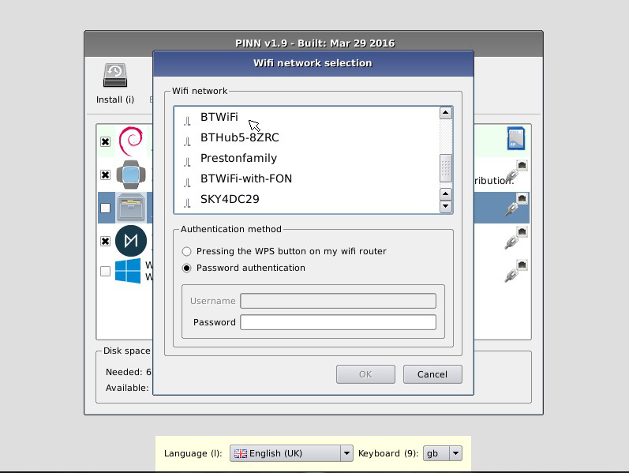

PINN will remember your wifi network connections, so it is only necessary to enter them once. Some operating systems, like Raspbian, will copy these  wifi connections when they install, so they will also be able to use them as soon as they are booted.

### Preconfiguring a WiFi network

If you already know your WiFi details, you can preconfigure PINN to use them straight away. Put a copy of your `wpa_supplicant.conf` file on the PINN root partition and PINN will read it and store it in its settings for all future uses. The file will be renamed to `wpa_supplicant.conf.bak` to prevent it from overwriting any subsequent changes you make to the Wi-Fi networks using the GUI. This file will also be passed on to some OSes when they install.

If you need to have more control over your network connection, like setting a static IP address, it is also possible to drop a new copy of the dhcpcd.conf file onto the PINN root partition and PINN will read it and store it in its settings for all future uses. The file will be renamed to `dhcpcd.conf.bak` after being copied.

### Network Drivers

From v1.9.4, the following network drivers have been added to support a wider range of Wi-Fi and network adapters:
* zd1211rw
* rtl8192cu - fixed in v1.9.5
* rt2500usb
* rt73usb
* rt2800usb
* mt7601u
* rtl8150
* r8152
* asix
* ax88179_178a
* dm9601
* smsc95xx

from v2.0
* rtl8188eu - for hubpiwi and others
from v2.1
* IoTpHAT
from 2.4.5f
* rtl8812

NOTE: Realtek wifi drivers (rtl8188eu, rtl8812au, rtl8192cu) are not present in v2.5.1 onwards.
NOTE: Realtek wifi drivers (rtl8188eu, rtl8192cu) are added back in from v3.2.4b

### Enabling SSH for Raspbian

In recent Raspbian releases, SSH has been disabled by default for security reasons. To override this and enable SSH from first boot, it is necessary to create a file called `ssh` or `ssh.txt` in the Raspbian boot partition. If PINN detects such a file in the PINN recovery partition, it will copy it across to the Raspbian boot partition whenever it is installed, enabling SSH to be enabled immediately, which is very useful especially for headless installs.

NOTE: this file does not enable SSH access to PINN. To enable that the 'ssh' keyword must be added to `recovery.cmdline`.

### How to change the default Language, Keyboard layout, Display mode, or Boot Partition etc.

Edit the `recovery.cmdline` file in the root PINN directory and append the following arguments where relevant:
- `lang=<two-letter language code>` (e.g. `lang=de` or `lang=en`)
- `keyboard=<two-letter layout code>` (e.g. `keyboard=de` or `keyboard=us`)
- `display=<display mode number>` (e.g. `display=1` or `display=3`)
- `partition=<partition_number>` (e.g. `partition=6`)
- `showall` (shows all available OSes regardless of your Raspberry Pi model)

Note that these defaults will be overwritten by any changes made in the GUI to these settings.

## Cmdline Options

The following is a complete list of all the PINN options that can be added to the `recovery.cmdline` file on the PINN recovery partition to affect its operation:

- **runinstaller**: This option is present when PINN is first installed to cause it to reformat the SD card. Once reformatted, PINN will delete this option. Manually adding it back in will cause PINN to reformat the SD card on next boot, losing any and all installed OSes, so be careful!

- **reserve=(+)NNN**: This option will reserve a set amount of space for PINN's partition (typically /dev/mmcblk0p1) when the `runinstaller` option first formats the SD card. This space may be useful for adding OS install files later, or for using the first partition as a transfer area for data between the RPi and a Windows PC that can only read the SD card's first partition. NNN specifies the total size of this partition in MB. The default value is around 64MB. If the size is prefixed with a '+' sign, the value indicates an amount of disk space to be reserved [i]in addition[/i] to the size of PINN's files. So, `reserve=200` will make P1 200MB in size and `reserve=+200` will make it about 263MB in size.

- **no_update**: Prevents PINN from performing a self-update check on boot up. Use the `reinstall` option to manually check for updates on PINN.

- **forceupdatepinn** - Forces a PINN self update if one exists, without user interaction.

- **nofirmware**: Prevents PINN from upgrading the firmware of old OSes to be compatible with PINN.

- **vncinstall**: Uses a VNC network connection to control PINN instead of any locally attached keyboard, mouse and display. When this is used, any local display will remain blank.

- **vncshare**: Uses a VNC network connection to control PINN. However, unlike `vncinstall`, any locally attached keyboard and mouse will still be active and the display will be duplicated to the local screen and the VNC connection.

- **ssh**: Enables an SSH connection to the rescueshell in PINN. It cannot be used to control PINN, but having a shell is very useful to perform remote maintenance on any of the SD card partitions.

- **rescueshell**: This option causes a local command shell to be opened when PINN is booted. When the shell is exited, PINN will then be booted as normal. Alternatively, inserting a physical jumper between pins 5 & 6 of GPIO header P1 will cause the rescueshell to be entered as well. 

- **lang=\<country code\>**: Sets the language to be used by PINN

- **keyboard=\<country code\>**: Sets the keyboard code to be used by PINN

- **display=\<1|2|3|4\>**: Sets one of 4 simple display modes

- **partition=\<part number\>**: Sets the default partition to be booted if no input is detected.

- **forcetrigger**: Forces the PINN interface to be entered on startup (as if the shift key had been pressed). This is very useful when using a VNC connection.

- **gpiotriggerenable**: Forces Recovery Mode to be entered on boot if GPIO pin 3 on header P1 is connected to GND (pin 25). 

- **gpiochannel=\<channel\>**: Allows a different GPIO pin to be specified to trigger the recovery menu.

- **gpiochannelValue=\<value\>**: This specifies the value the GPIO shoudl be set to to trigger the recovery menu. The default is 0. Specify 1 to trigger when the GPIO pin goes high.

- **keyboardtriggerdisable**: Prevents a `SHIFT` keypress from entering Recovery Mode on boot (maybe you have a problematic keyboard which is erroneously triggering every time you boot)

- **remotetimeout=\<time in secs\>**: When used in conjunction with `forcetrigger` it sets a maximum timeout period in seconds for the recovery menu to be displayed before continuing to the boot selection dialog and potentially selecting a default OS to boot. This permits normal default OS booting, yet also allows for a remote user to interrupt the startup process to change the OS to boot, or perform any remote maintenance. Any screen interaction over VNC will cancel the timeout. This additional timeout will lengthen the boot time into a default OS, so choose a value that is long enough to allow VNC access, yet short enough not to be annoying under normal circumstances.

- **networktimeout=\<time in secs\>**: PINN will wait for a default timeout of 8 seconds to detect whether a network is connected or not. (This is extended by an additional 4 seconds if wifi is configured). This setting allows the network timeout to be specified in seconds, especially for networks that take longer to establish. Setting a value of 0 will disable the "Please wait while PINN initialises" progress box and will wait indefinitely for the network before installing any required OSes.

- **disablesafemode**: If you have external hardware or an addon board connected to the GPIO header, you may find that pin 5 is being pulled low and accidentally triggering "Safe Mode" by entering the rescueshell. To prevent this, you can append `disablesafemode` to the `recovery.cmdline` file.

- **silentinstall**: Allows a single or multiple OSes to be installed automatically, useful during headless installs. See [How to Automatically Install OSes](#how-to-automatically-install-oses)

- **select=\<oslist\>**: Auto-selects a number of OSes or OS sources to be installed. When used in conjunction with `silentinstall`, the OSes are automatically installed without any user intervention. See [How to Automatically Install OSes](#how-to-automatically-install-oses).  
In addition to specifying a list of OS names, some reserved words are also available to specify different sources of OSes instead, or to control when they are installed. 
  - `allinstalled` - Normally, all installed OSes are automatically selected, but they are not selected when the "select" option is present. Adding 'allinstalled' will ensure they are selected again.  
  - `allsd` - Selects all OSes where the most recent one is on the SD card
  - `allusb` - Selects all OSes where the most recent one is on a local USB drive
  - `allnetwork` - Selects all OSes where the most recent one is on remote repositories.
  - `waitnetwork` - Waits for all OS lists to be downloaded from the internet before checking the list of OSes
  - `waitusb` - Waits for all OSes on local USBs to be listed
  - `waitsd` - Waits for all OSes on the SD card to be listed
  - `waitall` - Waits for OSes from all sources to be listed

- **silentreinstallnewer**: This is an advanced option and potentially _**Destructive to your data!**_. Do not use unless you are fully aware of its consequences. See [Auto-Reinstalling OSes](#auto-reinstalling-oses)

- **alt_image_source=\<url\>**: Provides the URL of an additional os_list_v3.json file indicating the location of other OSes that can be downloaded from the Internet. Multiple instances of this option can be used.

- **repo_list=\<url\>**: Provides the URL of a repo_list.json file that contains a list of URLs to other os-list_v3.json files. This allows easy remote management of Internet respositories.

- **repo=\<url\>**: Similar to `alt_image_source` but it matches the NOOBS method of specifying a list of additional respositories as a space separated quoted string.

- **no_default_source**: Prevents the default RaspberryPi Foundation repository from being used.

- **disableusbimages**: Prevents OSes stored on local USB memory devices from being used.

- **disablesdimages**: Prevent OSes stored on the SD card from being used.

- **no_group**: Prevents the list of OSes from being grouped into categories.

- **no_cursor**: Prevents the cursor from being shown on the boot selection dialog (requested for touchscreen devices)

- **showall**: Shows all available installable OSes, whether they are suitable for the current model of Pi or not. Useful for preparing SD cards to be used in other RPis.

- **bootmenutimeout=\<time in secs\>**: Changes the default timeout allowed before an OS is booted without any selection. (If this option is provided with a default sticky OS selected, the menu boot time will be respected, allowing you to choose another OS for this boot only).

- **noobsconfig**: Prevents any noobsconfig customisations from being applied to an OS on installation

- **configpath=**: Specifies a path or URL where the noobsconfig customisation files can be found (rather than being in /os/\<distro\>/)

- **background=\<r,g,b\>**: To change the background colour for the screen and most windows, add `background=r,g,b`, where 0,0,0 is black and 255,255,255 is white. I suggest to use values above 127.

- **wallpaper_resize**: Causes a customised wallpaper.jpg or wallpaper.png file to be resized to fill the entire desktop. As an alternative to 'background', a small (8x8) png file can be used to fill the desktop only with a particular colour, leaving the background of the other windows alone.

- **style=**: The style of the windows display can be modified to one of `motif`, `windows` or `platinum`

<!-- fixate not documented -->

- **dsi**: A special boot feature to swap the priority of the DSI and HDMI video outputs, allowing an OS to give priority to a HDMI screen if attached.


The recovery.cmdline can be edited using the [Edit Config](#easy-config-file-editor) option on the maintenance menu. From v3.2, this now includes an Edit Options button which launches a dialog to set all the options more easily using simpler checkboxes.

---

# Installing OSes

## OS Installation

Simply select the checkbox next to each OS you want to install, using either a mouse or keyboard (use the arrow keys to traverse the list; the Enter or Space key to toggle the selected OS's checkbox), then click the "Install" icon (or press "i" on your keyboard) to install the selection. The icons shown on the right of the list indicate whether the OS is being installed from the SD card (SD card icon), USB device (USB icon) or from the online OS repository (Ethernet icon).

_Some OSes may require some terms and conditions to be accepted before the OS can be installed._

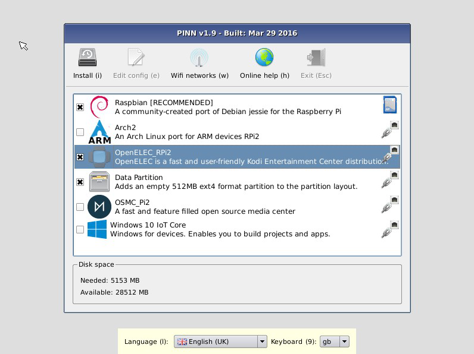

<sup>*NOTE: The list of OSes in this image is indicative only. It will vary according to your Raspberry Pi model and the availability of OSes on the installation sources.</sup>

### File Signatures and Checksums

OS maintainers have the option of providing signatures or checksums for their main OS tarballs/images and their partition_setup.sh script. These may be of type sha512sum, sha256sum, sha1sum or md5sum. When PINN sees such a signature it will verify the downloaded file against its signature for correctness and an error will result if they differ.

When a checksum error occurs during installation, 4 options are available:

- **keep** - Keep the current file and continue, but the OS will be marked as non-bootable
- **retry** - retry the file again
- **discard** - discard this file, but continue with any other OSes
- **abort** - Abort all OSes

When OSes are installed, the checksums are calculated during the installation, but for downloads and backups they are calculated at the end.

Checksums can be found in each partition section of the `partitions.json` file for tarballs, and in `os.json` for the `partition_setup.sh` script.

The keys: "sha512sum", "sha256sum", "sha1sum" and "md5sum" indicate the type of the checksum and its value is the checksum expressed as a quoted Hex string. Alternatively, the checksum value can be the URL of a standard digest file, being the captured output of one of these checksum programs.

## OS Network Installation

PINN allows additional operating systems to be downloaded from a remote repository. To do this, the Raspberry Pi must be connected to a wired network, or it can connect over Wi-Fi using the [Raspberry Pi USB wifi dongle](https://www.raspberrypi.org/products/usb-wifi-dongle/) or the Raspberry Pi 3 Model B built-in Wi-Fi.

Once connected, the Pi will only show a list of operating systems that are appropriate to your Pi Model. If you want to see _all_ available OSes, edit the `recovery.cmdline` file in the root PINN directory and append `showall` to the arguments list.

Once PINN has connected to your network, the IP address of the PI is shown in the window title bar.

### How to install OSes from an alternative network sources

If your Pi is connected to the Internet, PINN will present a list of OSes that are available for installation from the internet. By default, this list includes all of those available through the Raspberry Pi website, plus some others that have been converted specifically for PINN through the repo_list cmdline option.

PINN provides many options to customise the list of repositories that it will use for sources of OSes by using the following recovery.cmdline options:

- If no specific cmdline option is given, PINN will use the list on the Raspberry Pi Website.

- **no_default_source** will prevent the OSes on the Raspberry pi website from being used.

- **alt_image_source=** specifies an alternative source of OSes that can be installed from the internet. For example: <b>alt_image_source=http://newurl.com/os_list_v3.json</b> where `newurl.com` is the name of the alternative server and `os_list_v3.json` is the list of information about the alternative OSes. This list of OSes will be added to the default download list. This can be useful for storing the default repository on a local LAN server, or for adding your own list of OSes to those available in PINN. Multiple alternative repositories can be specified by including this option multiple times with different URLs.

- **repo=** option from NOOBS is supported by PINN. Using `repo` will replace the default RPF server repository, whereas `alt_image_source` simply adds a repository. To add multiple repositories add multiple space-separated urls to the single "quoted" repo option.

- **repo_list=** is used by default as it is a convenient way to support multiple repsositories by specifying one URL that points to a JSON file containing a list of other repositories. This makes it easier to maintain the OS list remotely for a set of users, rather than editing it manually on each Pi. For testing purposes, including a `repo_list.json` file on the PINN recovery partition will override any cmdline option and will be read instead.

## Local Images on SD card

PINN can install local images that are found in the `/os` folder on the SD card. These can include any of the original NOOBS images or any other OS that is formatted with a `.tar.xz` file for each partition.

Whilst this can be a convenient way to host the installable images as they can be installed offline, it does take up some valuable SD card space, so installing from USB is often better.

The easiest way to put OS installation images on the SD card is to first [download](#download) them to a USB stick and then copy the appropriate folder from the USB drive to the SD card.

Make sure to add any OSes to the `/os/` folder before you boot PINN in a RPi for the first time. Otherwise you will find the partition has been shrunk to its minimum size and there will be no room to add any more OSes to the card later. However, by adding the `reserve=` option, it is now possible to reserve some free space on PINN's 1st FAT partition for storing OS images on later, or for general transfer of data to/from a Windows PC.

## Local Images on USB stick

Due to the increasing size of OSes, it is becoming increasingly difficult to store their compressed installation files on the PINN SD card. PINN-lite contains no OS installation files by default, but you can copy selected OSes into the `/os` folder if you wish.

To counter this lack of SD card space, PINN supports storing the compressed OSes on a USB stick as well. This has the following advantages:

 1. The OSes are available to install when a network is not available.
 2. They do not take up any valuable space on the SD card.

The OSes should be stored on the USB stick in the same format as they would be on a PINN SD card (please see the [download](#download) section):

 1. Each OS should be stored in its own folder beneath the `/os` folder.
 2. They should contain compressed images of their partitions in `.tar.xz` format
 3. All supporting JSON files (etc.) should also be included.

If the same OS is available on the SD card, the USB stick, and the network, only the most recent version will be displayed.

## Installing TO a USB device

There are three ways for PINN to install an OS, which also depends on the RPi model you have:

1. Install to the SD card
2. Install the boot partition to the SD card and the rootfs to the USB device
3. Install the boot and rootfs partitions to the USB device.

_NOTE: PINN can only install the boot partition of an OS to the same drive that PINN is stored on. So for option 3, the USB drive must have PINN installed on it and the Pi must be booted from this drive._

### Option 1: Install to the SD card

This is the normal way to use PINN. PINN is stored on the SD card, is booted and installs the OSes to the remainder of the space on the SD card.

### Option 2: Boot on SD card, Rootfs on USB

There are several reasons why you may want to install an OS to a USB memory device: more capacity, more resilience, faster read/write operation and so on. PINN allows the rootfs to be installed to a USB memory device. However, the boot partition is kept on the SD card, so this technique is applicable to all RPi models.

1. Follow the basic instructions to format your SD card and install PINN on it.
2. Boot your Pi with the PINN SD card.
3. Insert a USB memory device (USB stick, hard disk etc) into the Pi). Make sure it has nothing of value on it because it will be erased and reformatted.
4. Select the new USB device in the dropdown box in the lower status window as the drive to install to and you will be prompted to format the device. Select Yes to continue.
5. Install the OSes you require as normal.

Using this technique you will always need to boot from the PINN SD card.

### Option 3: Boot and Rootfs on USB

This option is only applicable to RPi models based on the BCM2837 chipset (RPi3B and RPi2Bv1.2) which have the facility to boot directly from a USB device. However this mode must be enabled first, which can be done by following the instructions at: https://github.com/raspberrypi/documentation/blob/master/hardware/raspberrypi/bootmodes/msd.md

Once USB boot mode is enabled, proceed as follows:

1. Format the USB device as FAT 32 and copy the PINN files to it, just as you would for a normal PINN installation on an SD card.
2. Boot PINN on the Pi from the USB device.
3. Install your requried OSes as normal.

## Project Spaces

Project Spaces are empty OSes that just consist of an empty 100MB FAT32 partition and an empty 500MB nominal ext4 partition. Up to 8 Project Spaces can be installed onto an SD card along with any other OSes. Any remaining space left on the SD card will be divided up between all of these Project Spaces, so their ext4 partitions will expand to fill the remaining space and they will all be the same size.

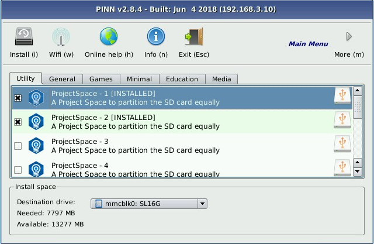


Project Spaces are useful when used with the [Replace](#replace-individual-os) OS function, as they reserve OS space that can be used later. The 3 main benefits are:
1. They reserve OS space, so the choice of which OS to install or add can be made later on.
2. They allow multiple instances of the same OS to be installed.
3. They allow the same amount of space to be used for each OS.

When replacing a project space with another OS, remember that the new OS must have the same number of partitions as the project space and each partition must fit within the existing partition sizes. So creating 8 project spaces on a 16GB card may not be very useful as there will be &lt;2GB left on each of the ext4 partitions. That maybe ok for some of the minimal OSes, but no good for a full Raspbian installation, for example.

## PINN's Firmware Upgrade/Downgrade

PINN v2.5.3+ includes new firmware, kernel and drivers to support the new Pi3B+ model. Whilst this firmware will allow PINN to run on all RPi models, some older OSes may not yet be compatible 
and will not boot from PINN. So when booting on models older than the 3B+, PINN's firmware can be downgraded so that these older OSes can still boot from PINN. 
Prior to v3.2.4, On first startup on an older RPi model, PINN will automatically downgrade the firmware. It will need upgrading manually if you want to use the latest firmware.
From v3.2.4 onwards, the automatic downgrade has been removed and it must be downgraded manually if required.

Once PINN's firmware has been downgraded, it will no longer run on the RPi3B+. To run it on a RPI3B+ again it is first necessary to upgrade the firmware on an older model.
There is a menu item on the Archival menu to upgrade or downgrade PINN's firmware accordingly. it is disabled on the RPi 3B+

## OS firmware upgrade

When PINN is running on upgraded firmware for the RPI3B+, it will try to upgrade the firmware of any OS that is installed, if it is too old to run on the RPi3B+.
This may allow the OS to boot, but the Ethernet, wifi and USB may not work unless the drivers for these devices are upgraded.
If this is not required, the `nofirmware` option can be used to prevent the firmware from being upgraded.
This firmware upgrade feature is disabled when downgraded firmware is in use.

Many OSes that support the Pi3 will need updating to support the new Pi3B+ model, so the list of available OSes for this Pi3B+ may be limited for a while. Adding the `showall` option may allow them
to be selected, and PINN's new firmware upgrade feature may allow them to boot, but the kernel and drivers will still need to be updated to allow the new hardware features to be used.

## How to Automatically Install OSes

### Auto-Installing one OS

Even if you are using your Pi without a display, you can still use PINN to easily install an OS of your choice. To set up PINN to install a specific OS automatically and silently (i.e. without requiring any user input), follow these steps:

1. Copy the OS folder for the OS you want to install into the `/os` dir (alternatively, delete all other OSes contained in the `/os` dir so that only your chosen OS remains).
2. If the OS you want to automatically install has multiple flavours available, edit the `flavours.json` file so that it only contains the entry for the flavour that you want to install.
3. Edit the `recovery.cmdline` file in the root PINN directory and append `silentinstall` to the arguments list.

When you now boot your Pi using an SD card containing the modified version of PINN that you just created, it will automatically install the OS you chose and boot into it after the installation has finished. 
NOTE: `Silentinstall` only works if there are no OSes installed already to prevent accidental OS deletion.

From v2.8.5 onwards, the network is always enabled, even when `silentinstall` is specified. So it may be necessary to temporarily disable any network sources whilst the `silentinstall` option is being used to prevent remote OSes from being listed, which would cause `silentinstall` to fail. YMMV.

### Auto-Installing several Named OSes

The `select=` option can be used to provide a comma separated list of one or more OS names that should be selected automatically. Ensure the whole argument to Select is enclosed in quotation marks.
Normally, any installed OS is automatically checked, but this will not happen if the `select=` option is present. To restore this behaviour with the `select=` option, add `allinstalled` as a special flag.

e.g. `select="Raspbian,LibreELEC_Rpi2,allinstalled"
Will install the Raspbian and LibreELEC OSes, plus any OSes that are already installed.

If a particular OS you want to install is on a particular source, you can force PINN to wait until that source has been listed by adding additional flags:
`waitsd` will wait for all OSes on the SD card to be listed.
`waitusb` will wait for all OSes on a USB drive to be listed.
`waitnetwork` will wait for all OSes on remote OSes to be listed.
`waitall` is a shorthand way of including all OSes and is equivalent to `waitsd,waitusb,waitnetwork`

PINN only carries out the OS selection once all sources are present. So if you wait for a source that is not present, PINN may wait indefinitely until it appears.
This is modified in v2.8.5.1 to try and avoid indefinite waits. However, adding a `networktimeout=0` option will wait indefinitely for the network to be present before silently installing.

The `select=` option only determines which OSes are selected in the recovery menu at startup; it will not do anything with the listed OSes by itself.
By adding the `silentinstall` option as well, then all selected OSes will be silently installed without user intervention. However, `silentinstall` only works 
if there are no OSes installed already to prevent accidental OS deletion.
It is also used with the `silentreinstallnewer` option, but this has fewer safeguards. Please read the warnings below.

Unlike using `silentinstall` on its own to install a single local OS, when using it with the `select=` option, PINN must read in all installation sources, 
so the recovery menu MUST be entered for this to occur. You can do this by using one of the many trigger options at startup, e.g. pressing the shift-key. 
For remote operation, consider using the `forcetrigger` option, maybe in combination with `remotetimeout` if necessary.

### Auto-Installing OSes based on their source

If you want to select all OSes present on the SD card, USB stick, or on a remote repository, then the following flags can be used for the `select=` option respectively:
`allsd`, `allusb` or `allnetwork`. Each option also implies the corresponding `waitsd`, `waitusb` or `waitnetwork`.

Note that when OSes exist on multiple sources, PINN selects the most recent one (or the local one if they are equal).
So, for example, if 'allnetwork' is specified and you expect a remote Raspbian OS to be installed, it will not be if a more recent version exists locally, because the remote OS will be overridden by the newer local version. If you want a particular source of an OS to be installed, it may be necessary to hide the other sources using disableusbimages, disablesdimages, or disabling the remote repositories respectively.

The `select=` option will not install the listed OSes by itself, but by adding the `silentinstall` option as well, then all selected OSes will be silently installed without user intervention. However, `silentinstall` only works if there are no OSes installed already to prevent accidental OS deletion.

## Installer Slideshow

An installer slideshow guides you through your first steps with each OS while it installs.

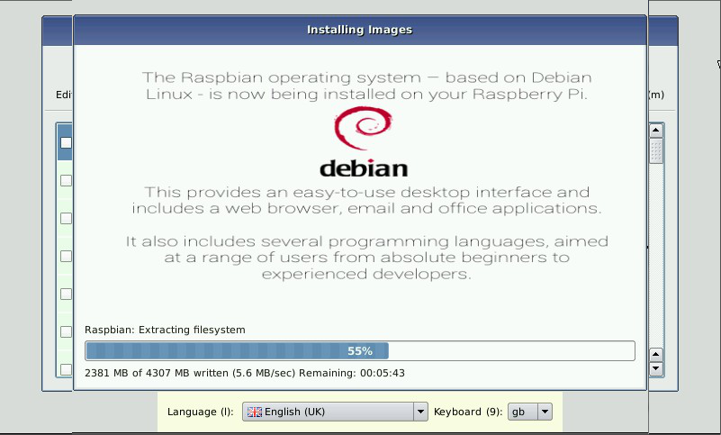

### Auto-Reinstalling OSes

The `silentreinstallnewer` option is added by particular request for a specific purpose, so be sure you understand how it works before using, otherwise you are at risk of 
losing your data.

It is used in conjunction with the `select=` option to automatically reinstall any installed OS selected by that option if a newer version is found to exist
on any installation source that is newer than the currently installed version. THERE ARE NO OTHER CHECKS except the name of the OS and its release date, so this option may 
unexpectedly wipe out any existing OS and restore it to a factory default state if you make a mistake - YOU HAVE BEEN WARNED! 
For this reason, it may be beneficial to install a Data Partition on your installation drive, on which all user data is stored, rather than storing it on the OS partition. 
In this way, the user data can be preserved when the OS is re-installed.

It is advisable to only use named OSes in the `select=` option. Using any of the general options like `allinstalled` & `allnetwork` etc. May result in unexpected consequences!
Likewise, you may wish to restrict your installation sources to a single location with judicious use of the `disableusbimages`, `disablesdimages` and the network source options
to avoid a newer OS being installed from an unintended source.

## Installation Progress

During the installation of the operating systems, PINN will write the percentage completed to a text file called `/tmp/progress`. The format of this file is an integer (0-100) followed by a space, a '%' symbol, and a line feed. It is only updated when the progress changes by at least 1%. Sometimes PINN will not know the maximum size; in this case, it shows the amount data written in MBs.
This feature mimics the progress dialog on the display and is useful in headless setups to monitor the progress of the installation.

## Background shell script

To make use of the installation progress feature, a background shell script can be used. If a `/background.sh` script exists, it will be executed in the background whilst PINN runs. This can be used to read the `/tmp/progress` file and display the progress on the serial port, a GPIO-based display, etc. amongst other things.

## Initialisation shell script

If a script called /pinn_init.sh exists in PINN's recovery partition, it will be executed before PINN is started. 
This script will be mounted as /tmp/media/pinn_init.sh and must complete before PINN starts. 
It can be useful to initialise third party display drivers before the main PINN splash screen is shown.

---

# Booting an OS with PINN

There are several ways of controlling the boot process and determining which OS gets booted. 

When PINN is booted, it displays a splash screen which provides enough time for the user to interrupt the boot process and go to the PINN recovery mode. The user may press the shift key, touch the logo on the touchscreen, press the left mouse button, or any recognised TV remote button when using the CEC interface to interrupt the boot process.

The recovery mode will also be entered if no OSes have been installed, the `forcetrigger` is used or the GPIO trigger is used. Otherwise PINN will continue to boot one of the installed OSes

## Booting a single OS

If only one OS is installed, the boot selector will not be displayed and the OS will boot automatically.

## OS Boot Selector

After multiple OSes have been installed, a boot selection dialog is presented to list all the installed OSes for the user to choose one to boot. PINN will remember this OS choice and boot this OS by default each time unless a different option is selected within a timeout of 10 seconds. It is possible to change this menu timeout by adding `bootmenutimeout=X` in the `recovery.cmdline` file, where `X` is the desired timeout in seconds.

A Boot button has been added for easier selection with limited CEC TV remotes, mice or touchscreens.
Also a Cancel button (Shortcut=Esc) is provided to boot back into PINN again.

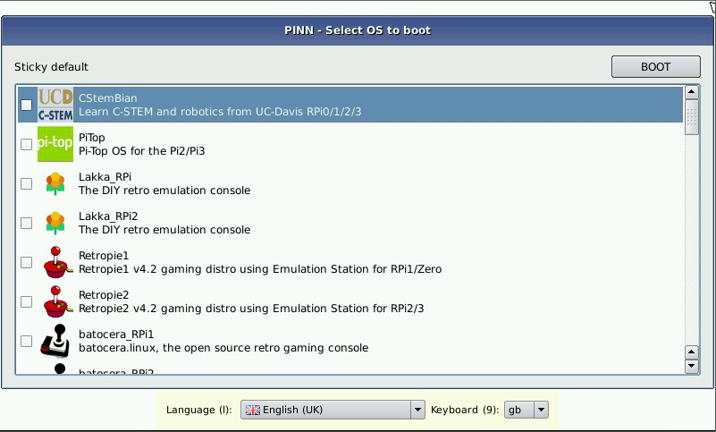

## Sticky Default OS

Each OS entry in the boot selection dialog has a checkbox next to it, allowing users to select it as a sticky default OS. If an OS is checked, PINN will operate as if that were the only OS installed (booting it automatically, without showing the boot selection dialog). This permits a slightly faster boot up time when one OS is used regularly. 

To change or remove the sticky checkbox, or just to temporarily boot into another OS, the boot selection dialog can be shown again by pressing the Shift key on boot up and entering the recovery mode. Alternatively, if the cmdline **`bootmenutimeout`** option is specified, the bootmenu will be displayed for this timeout period before booting the selected OS, providing an alternative opportunity to change the OS to be booted.

## OS Boot selection order

The order of the OSes presented on the boot selection dialog is dependent on their physical position on the drive, essentially the order they were installed. Using the up and down buttons, any selected OS can be moved up or down in this list, and hence the order can be changed to suit your needs.

### Reboot shell script

Just before PINN boots into the selected OS, it will execute 
`/before-reboot.sh` if it exists. A typical example for this script is to turn off the backlight of the Raspberry Pi 7" touch screen display. Be aware that any such script here must execute and finish before PINN will continue to boot the selected OS.


## How to bypass PINN and boot directly into a fixed partition

PINN provides many administration functions to assist you in installing, maintaining and booting multiple OSes. But to do this, it does slow the boot process down a little to allow time for the user to interact with the boot process. But even if you have installed multiple OSes, there may be times when you would like the Pi to always boot into one specific OS as quickly as possible and hide PINN completely.

After you have installed your chosen OSes, add the following file to the root directory of PINN to force a specific OS to be booted each time.

1. Add a text file named `autoboot.txt` to the root directory of PINN.
2. Add `boot_partition=<partition number>` to the file and save it to disk.

The <partition_number> is the partition number of the boot partition of the OS you want to boot at each power on. The partition number can be found by running `sudo fdisk -l`. The partition will be one of the FAT32 partitions e.g. `/dev/mmcblk0p6` would be partition 6. It can also be found by looking at the installed_os.json file on the settings partition (partition 5) of the device that PINN is installed on. This will also prevent the splashscreen from being displayed at boot. 

NOTE: that once an `autoboot.txt` file is present, there's then no way to force the PINN GUI to display, until you delete (or rename) the `autoboot.txt` file. The SD card behaves as if PINN were not there at all.

## Booting an OS directly from the recovery shell.

The ususal `reboot` command does not work in the PINN recovery shell. However, a new command `rebootp` has been added to allow this. By providing a partition number as an argument, it is possible to boot directly into one of the installed OSes directly. E.G. `reboot 6` will boot direclty into the OS installed in partition 6. There is also `rebootp.sh` which may be better to use from an ssh shell, as it provides a cleaner exit to the ssh terminal.

---

# Other Features

## Online Help via Web Browser

The built-in Arora web browser allows you to easily get help via the Raspberry Pi Forums (network connection required).


## Info on OS

The Info button will take you to the web page specific to the currently highlighted OS in the selection list (network connection required).

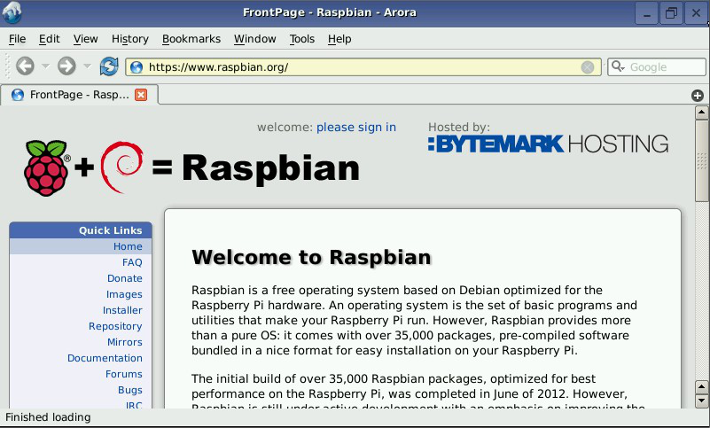

## Clear

The clear button will de-select any selected OSes either in the available or isntalled lists. On startup, PINN will auto-select any installed OSes, but this may be overridden
by the select option. In any case, this button provides a quick way of de-selecting all OSes in case you want to start afresh, without having to track them all down in the 
various tabs and windows.

## Exit

The Exit button (Esc) will exit recovery mode and go to the boot selection dialog, or directly boot the OS if only one is installed. The Exit button is ony enabled if bootable OSes have been installed. If only data partitions or ProjectSpaces have been installed, for example, then it will be greyed out.
From p3.2.4 It is also possible to exit to the boot selection dialog from the other menus by pressing the Esc key, even though there is no toolbar button available.

---

# Archival Menu

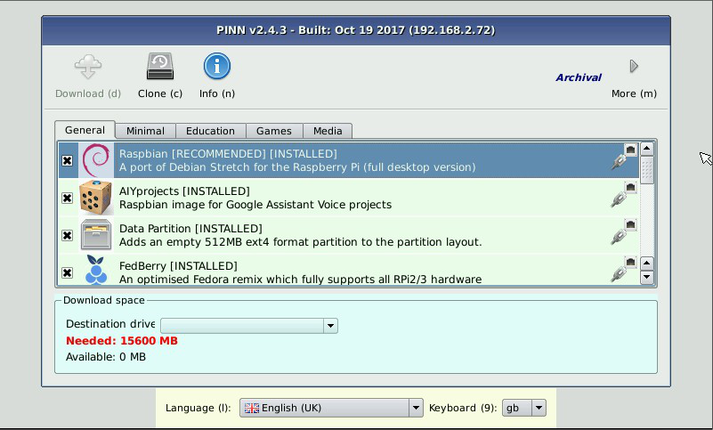

## Download

As documented earlier, PINN can install an OS from a local USB disk instead of directly from the internet for use when no internet is available, or to avoid repetitive slow or costly downloads. But to do this, the OS and is accompanying meta-files must be downloaded from the internet to the USB drive. PINN's `download` feature allows this task to be done easily. It will only download OSes that are sourced from the network - selected OSes on a USB stick, for example, will be ignored.

You will be asked if you want to resume partial downloads. Only select this option if a previous download failed and you wnat to continue downloading the same file rather than starting again. Selecting Yes when no partial downloads are available could end up extending an existing file with a newer file, causing a problem.

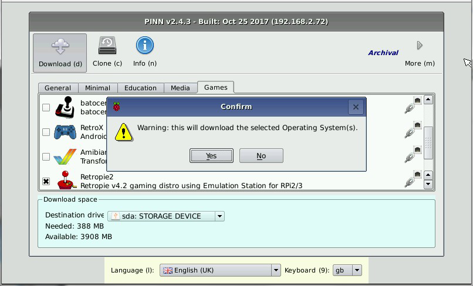

1. Format a USB drive as FAT32,ext4 or NTFS and create an `/os` folder on it.
2. Insert the USB drive into the Pi.
3. On the Archival Menu, select the USB drive in the status window.
4. Select the list of OSes you want to download
5. Select the Download button and wait for the OSes to download.
6. Prior to v3.0.1, PINN will need rebooting to recognise and add these new OSes, but this is no longer necessary.

The download icon is only available when the download size of all files are known. If the download icon is greyed out, and the toolbar indicates that that there are still more files to check, please wait until all files are checked. 

The download function will also download OS flavours and their customisation files from a remote repository. When downloading flavours, it is only necessary to download 1 of the flavours and all associated flavours will be downloaded. (OSes that have flavours should include all their additional flavour customisations in a single flavours.tar.xz file to allow for their download).

After a file is downloaded it is checked against its signature checksum, if one is available. See [File Signatures and Checksums](#file-signatures-and-checksums)

_Some OSes may require some terms and conditions to be accepted before the OS can be downloaded._

## How to Clone an SD Card

Raspbian has added an SD Card Copier tool called `piclone`, which is great. For anyone concerned about it cloning a live system, 
it has now been ported into PINN so that it can clone the SD card offline, whilst the OS is not running. 

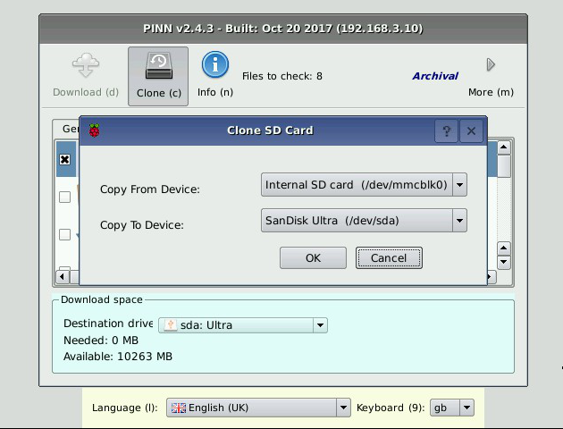

1. On the PINN screen, select the new `Archival` toolbar by pressing the `More` button.
2. Insert a second SD card into the Pi using a USB card reader.
3. Select the Clone SD card button.
4. Select your internal SD card as the source (/dev/mmcblk0) and the SD card in the USB reader as the destination (usually `/dev/sda`).
5. Select OK to clone your SD card.

All partitions will be copied onto the second card whilst the last partition will be sized to fit the remainder of the SD card if that option is selected. 
In this way, your existing data can be migrated to a smaller or larger SD card.

_Note1: that if you have installed multiple OSes using PINN, only the last partition of the last OS on the SD card will be resized._
_Note2: The clone function can also be used to copy any USB drive to any other USB drive - it doesn't have to include the SD card at all._
_Note3: Be careful when choosing source and destinations drives not to overwrite any important drives._

## Set Time

The Raspberry Pi has no real time clock, but it needs to know the correct time for https transfers and to timestamp any backups.
The Pi's clock can be set automatically once it is connected to the internet, but this function can be used to set the clock manually if no internet connection is available.
If a backup is attempted with no internet connection, this function will be called first to ensure the current time is set.

## Reload Repos

If PINN cannot access the internet when it starts, it will not be able to download the lists of repositories or the OS distribution lists. Normally it will retry when the internet connection is restored, but in some circumstances this will not happen. If this is the case, the lsit of repositories and OS distribution lists can be reloaded manually through this option.

<!-- ## Wipe the Drive

This option will wipe your drive of all installed OSes by deleting all the OS partitions and restore its capacity to full size by expanding the first partition to the whole disk size, 
but PINN will remain on the card. This allows you to manually copy additional OS distribution files to the /os folder from a USB stick, for example.

After wiping a drive, the Install and Download functions should no longer be used until the drive has been properly partitioned again since the drive is no longer in the correct format. 

This function also adds the `runinstaller` option to the recovery.cmdline file, so on next boot of this card, the full PINN partition structure will be restored allowing OSes to be installed or downloaded again.
-->
---

# Maintenance Menu


The maintenance toolbar contains commands to execute on installed OSes only, so the main window will only show a list of those OSes that are installed.

The first entry is a dummy fixed entry called `PINN` which represents the PINN recovery partition. This enables the same toolbar commands to be carried out on the PINN recovery partition, such as doing a file system check or editing recovery.cmdline or config.txt files. Of course, changing the password will have no effect.

## Easy Config File Editor

The built-in config file editor allows you to edit the config file of the OS that is currently highlighted in the OS list. This allows you to easily add license keys to different OS installs through the same interface.

When the PINN entry is selected, it allows you to edit the recovery.cmdline instead of the cmdline.txt file. A button called "Edit Options" will also appear which can launch a dialog box with all the possible options laid out amongst 4 tabs. This means you no longer need to remember all the option names as check and edit boxes are used instead.

Note that the output mode selected by the user through pressing one of number keys 1 to 4 (for HDMI preferred, HDMI VGA, Composite PAL, and Composite NTSC, respectively), will be automatically set in the `config.txt` files of your installed OSes. This means that you shouldn't have to worry about manually changing your display settings to get your installed OS to display correctly on your display device.

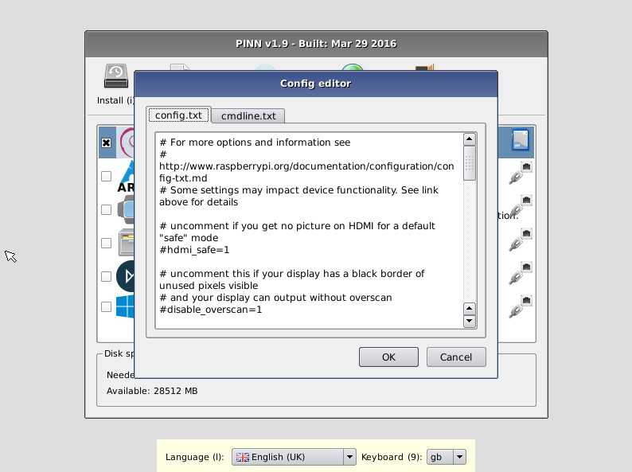

## How to Recover from a lost password

If you have changed your login password for an OS and forget what it is, PINN will allow you to reset it back to its default or set it to a new value.

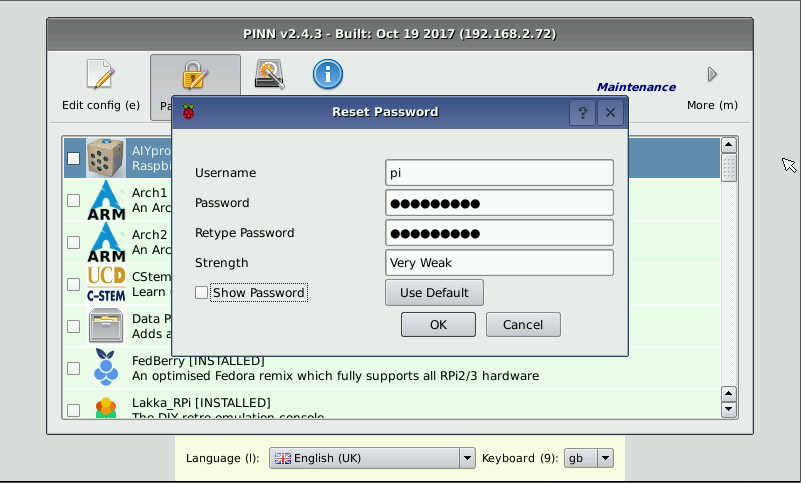

1. On the PINN screen, select the new `Maintenance toolbar` by pressing the `More` menu.
2. highlight the installed OS that you want to reset the password in.
3. Selecting the Password button will display a dialog box to enter the new password details.
4. Enter the username you want to change the password of.
5. Enter the new password (twice). Both copies must match. The second will be displayed red if it is different.
6. The password strength meter is a useful indication of how good a password you have created.
7. The `Use Default` button will enter the default username and password for the selected OS.
8. Tick the `show password` box to display the passwords on the screen.

## Backup

The backup function allows an installed OS to be backed up to a USB drive. The USB drive must first be formatted as FAT32, ext4 or ntfs and have a /os folder on it to store the backups in, otherwise it will not be recognised.

Select all OSes to backup and then click the backup button. After a confirmation dialog, OSes that are not suitable for backing up will be indicated in a dialog box and deselected. These currently include Risc OS, XBian and Win10 IoT. Some other OSes have required modified setup scripts in order to restore them properly after backing up. If you are trying to backup an OS that was installed prior to this modification, PINN will try to install these modified files from an installable source. So to backup such an OS it may be necessary to connect the RPi to the internet or plug in a USB stick with the OS installation files on it.

When an OS is backed up, it is given a name that includes the current time as a suffix in the format #YYYYMMDD-HHMMSS so that backups can be readily identified. If the RPi does not know the current time because it is not connected to the internet, you will be prompted to enter the current time. PINN gives you the opportunity to change this suffix and alter the OS description in the next dialog.

This Backup feature is also useful to create Custom OS versions that can be installed by PINN or NOOBS onto other systems.

OSes are backed up in NOOBS/PINN format as .tar.gz files. These do not compress as well as .tar.xz files, but require less memory and can be created faster on the RPi.
Nevertheless, compressing tar files is still a processor intensive task, so backing up an OS will take a lot longer than installing an OS, especially on some of the less powerful RPis.
Due to the compression, it is not known precisely how much disk space is required to store the backup, so PINN makes a conservative guess of 33% of the original size. It may require more or less than this amount, but if less disk space is available, a warning message is displayed, but the backup may continue if you wish. If there is insufficient disk space to complete the backup, this should be indicated. (You can also check the log in /tmp/debug for any errors.)

**Backups should be thoroughly tested that they are valid and restorable before relying upon them. This is a new PINN feature and every effort has been made to ensure it works as expected, but the author accepts no liability or responsibility for loss of data.**

After backing up an OS prior to v3.0.1, it may not show up in the list of installable OSes until PINN is rebooted, but now it will appear immediately in a separate "Backups" tab with all the other backup versions.

When an OS is backed up, an sha512sum signature checksum is calculated for each tarball which will be used to verify its correctness when next installed. See [File Signatures and Checksums](#file-signatures-and-checksums)


## Restoring Backups

There is no specific "Restore" button to restore a Backed up OS. As the backup is aready in NOOBS format, the backed up OS can be installed as any other OS to a fresh (PINN format) SD Card or USB drive, or they can be used to replace an existing OS or ProjectSpace (if it is in a compatible partition layout).

When a backed up OS is restored, PINN will fix up partition references by running the partitions_setup.sh script. However, certain tasks in that script that are only needed on an initial install will be skipped, as it is assumed they were already done and are not needed on restoration. This also includes the copying of ssh and wpa_supplicant.conf files from the PINN partition. Flavour customisation scripts are also not executed.

Backed up OSes may be installed by NOOBS, but some OSes may not restore properly due to the need for modified setup scripts (see above) that NOOBS is not aware of.

## How to Fix an OS

If your installed OS will not boot, the Fix option in the maintenance menu may help. It provides a list of operations that you may perform to fix the OS. Check all operations that you want to be performed on your selected OSes.

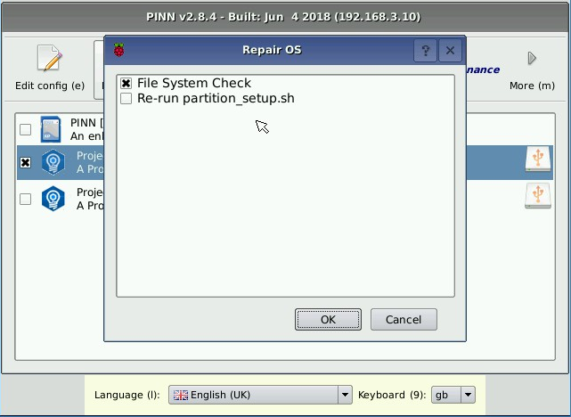

### File System Check

Most RPi OSes typically delay writing any data back to SD or USB drives for performance reasons. Normally, this does not cause a problem provided the Pi is shutdown properly before removing the power, but this is not always possible. You may experience a power loss, or a program crash where pulling the power is your only recourse to recovering control. In these circumstances there is a risk that the SD card or USB drive may become corrupted if some data failed to get written to the drive before the power was lost. 

To recover from a corrupted drive, PINN includes a file system check option which will perform an `fsck -y` command on all partitions of the selected installed OSes. The output of the `fsck` command will be shown in a dialog box that can be scrolled to check the result. If it shows that recovery was unsuccessful, you may need to use more advanced disk recovery tools to fix the problem. Since this check option will work on multiple OSes, it is necessary to select the checkbox of each OS you want checked, otherwise no OSes will be checked. If you are paranoid, you may want to make a backup of any affected partitions before trying this fsck option.

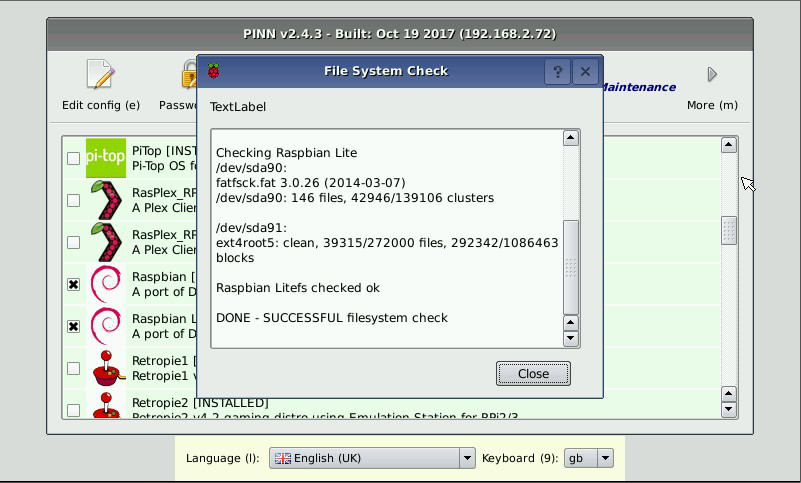

### Re-run partition_setup.sh

Installed OSes may be upgraded using their standard upgrade procedure (e.g. sudo update;sudo upgrade etc.). However, some OS upgrade procedures may not be aware that they are running in a multi-boot environment and may break the changes PINN made to allow them to work. In this situation, re-running the OSes partition_setup.sh script should fix-up these changes to allow the OS to boot properly. From v3.0, PINN will now skip initial installation tasks in this script and it is restricted to fixing up partition references.

### Show Debug Log

This option displays PINN's debug log in a window to make it more accessible rather than having to go through the command shell. The log is continually updated, so the view needs to be updated by pressing the refresh button to see any more recent logs that may have occurred.

## Reinstall Individual OSes

The `install` function will install one or more OSes to your drive, allowing a multi-boot configuration. However, all selected OSes must be installed at the same time as it will repartition and format the drive prior to installing the OSes, thus wiping out any previous installations.

The `Reinstall` option gets around this by allowing individual installed OSes to be over-written with the latest version of the corresponding OS, leaving all other OSes intact. As it does not repartition the drive, the new OS must fit within the same partition sizes as the OS occupied the last time it was installed.

PINN itself is included in the list of installed OSes. If it is the ONLY OS to be selected, reinstalling it will perform a manual self-update check which is useful in the case where the `no_update` cmdline option has been used.

## Replace Individual OSes

The `replace` function will allow the replacement of an installed OS with another different OS, provided the number of partitions in the two OSes is the same and the new OS will fit within the existing partition sizes. So it will work with most OSes, but not for those that use a non-standard partition layout. Windows IoT and RiscOS are specifically excluded and it is unlikely many Android versions witll work, but your mileage may vary. Any other installed OSes will remain unaltered.

This is particularly useful with the [Project Spaces](#project-spaces) feature, which will allow OS space to be reserved for installing an OS at a later date.

To replace one or more OSes, first select the new OSes you want to install on the `Main Menu`. Then move to the `Maintenance Menu` and select the OSes (or project Spaces) that you want to be replaced and click the `Replace` button. A dialog box will pop up lsiting all the OSes to be replaced. Alongside each one is a drop down box, where you can select which new OS shall replace each installed OS. The Click OK to replace the old OSes with the new OSes.

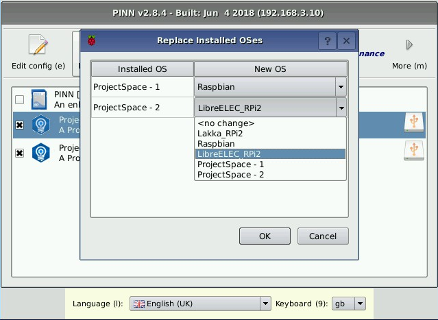


## Alias

The `alias` function will allow an installed OS to be given an alias name, which can be used to rename an OS.  
When selected, a dialog box will open where the alias can be edited. The description of the OS can also be edited here.  
This can be useful to distinguish multiple copies of the same OS that have been installed using ProjectSpaces.

---

# Advanced Usage

## How to create a custom OS version

There are two main use cases for which you may want to create a custom version of one of the standard OS releases that is suitable for installation via PINN:
- If you are a teacher wanting to easily deploy a custom OS release containing pre-defined set of packages and files onto a number of SD cards (e.g. to provision a class set of Raspberry Pi's or quickly restore a Raspberry Pi back to custom "factory" settings).
- If you want to be able to back up your existing installed packages and files so that any future OS re-install does not force you back to a clean install.

The following steps allow you to create a modified copy of one of the standard OS releases that contains your custom files, packages and settings.

1. Download a base version of PINN from http://downloads.sourceforge.net/projects/pinn/pinn-lite.zip.
2. Extract the PINN-lite zipfile.
3. Navigate to the `os` directory.
4. Create a copy of the folder containing the OS release that you want to modify and rename it with a custom name.
5. Edit the following fields in the `os.json` file contained in the folder that you just created:
  * "name" - replace the name of the base OS with the name of your custom OS version
  * "description" - replace the description of the standard OS install with one for your custom OS version
6. [Optional] Rename or replace the existing `<OS>.png` icon file with one matching the name of your custom OS version.
7. [Optional] Replace the PNG image files in the `slides` and `slides_vga` directory with your own custom installer slides.
8. Edit the following fields in the `partitions.json` file contained in the folder that you just created:
  * "partition_size_nominal" - replace the numerical value with the size of the paritions in your custom OS version
  * "uncompressed_tarball_size" - replace the numerical value with the size of your filesystem tarballs when uncompressed
9. Replace the `.tar.xz` root and boot filesystem tarballs with copies created from your custom OS version (these instructions assume you're only using a single OS at a time with PINN - they won't work if you're running multiple OSes from a single SD card). The name of these tarballs needs to match the labels given in `partitions.json`.
  * To create the root tarball, you will need to run: `sudo bsdtar --numeric-owner --format gnutar --one-file-system -cpf \<label\>_root.tar .` from within the root filesystem of your custom OS version. You should then compress the resulting tarball with `xz -9 -e \<label\>_root.tar`.
  * To create the boot tarball, you will need to run `sudo bsdtar --numeric-owner --format gnutar -cpvf \<label\>_boot.tar .` from the boot partition of your custom OS version. You should then compress the resulting tarball with `xz -9 -e \<label\>_boot.tar`.

_More detailed instructions are available in the Wiki at https://github.com/procount/pinn/wiki/How-to-Create-a-Multi-Boot-SD-card-out-of-2-existing-OSes-using-PINN_

Also note that if your custom OS is already on a PINN formatted SD card but you've made some changes that for example you want to install as a custom OS to other cards, then simply backing up the OS will create a custom OS version.

## How to customise an OS install (noobsconfig)

PINN can be used as a recovery program, so if your OS gets corrupted, messed up, or otherwise goes wrong, you can reinstall a clean version of the OS and start again. On the other hand, starting again from scratch can be painful, especially if you can't remember how you set up your perfect OS environment.

Creating a custom OS version (see above) for your preferred setup is one option, but it can look daunting to do, and would need to be repeated if you want to update it to include the latest build of the OS.

[Noobsconfig](http://github.com/procount/noobsconfig) is an alternative option that creates a customised OS by installing a standard OS, but then copies your own files over the top to add your own customisations according to your selected "flavour". These additional files are specified in a simple text file that controls their installation. For example, these can be simple configuration files, workshop exercises, tutorials, or Wi-Fi setup files. Alternatively, they could be scripts that are configured to run on first boot to further configure your OS by automatically installing your favourite packages.

By keeping the customisations separate from the OS distro means:

1. A custom installation can be created out of a standard OS installation plus some additional files, without having to create a full customised OS.
2. The same customisations can be applied to a newer version of the standard OS installation without having to rebuild a custom OS installation.
3. By using simple configuration files, it is easy to add files to configure your OS.
4. Different customisation "flavours" of an OS can be created as a master installation card, and the required ones can be selected and installed as required. This can save a lot of SD card space compared to storing a different full customised OS for each flavour.

PINN now includes direct support for `noobsconfig`, so it is no longer necessary to add the `noobsconfig` files to your PINN installation. Just add your configuration and customisations files and install your "flavoured" OS. Please see (https://github.com/procount/noobsconfig) for full documentation on how to use this feature.

The `configpath` command line option will cause PINN to search for the customised files in another location (folder or URL) rather than the same location as the os_info.json file for the OS, but this will affect ALL OSes.

The [PiKitchen](http://www.pihardware.com/guides/pi-kitchen) is an example of how comprehensive these configurations can be if you want them to be.

## How to auto-switch HDMI/DSI screen configurations

If an HDMI and a DSI screen (such as the Raspberry Pi Touch Screen) are both connected to the Raspberry Pi, the selection of which screen is to be used as the default needs to be selected in the `config.txt` file, which means constantly having to change `config.txt` to match whichever screen is required. This is because the DSI screen can only be selected at boot time, although without *any* configuration, the GPU will select the DSI screen in preference to the HDMI. PINN provides some limited ability to reverse this priority. 

This use case assumes that the DSI screen is always connected, and is normally used. But if an HDMI screen is connected, then the display will automatically switch to it. 

1. Create a `config.txt` file in the PINN root partition. Ensure it has the line `ignore_lcd=1` to disable the DSI screen and select the HDMI screen.
2. Edit `recovery.cmdline` and add the `dsi` keyword.
3. In the boot partition of any installed OS, create a `config.dsi` file to configure the DSI screen, and a `config.hdmi` file to configure the hdmi screen. (This can mostly be setup using a custom flavour with the `noobsconfig` feature so it can be installed automatically.)

When PINN boots, the HDMI screen will be selected, so to use any PINN feature, an HDMI screen **must** be connected. 

PINN will automatically boot the last selected OS after it times out. If a HDMI screen is attached, PINN will copy the `config.hdmi` file to `config.txt` on the selected OS and reboot into it.

If an HDMI screen was not detected, PINN will copy the `config.dsi` file to config.txt on the selected OS and reboot into it.

When using this technique, do not make any modifications to config.txt directly otherwise they will be overwritten by PINN on next boot. Instead, modify the appropriate config.dsi or config.hdmi file.

### Automatic Screen Detection

From v3.1 PINN includes automatic screen detection amongst HDMI, DSI and Pimoroni Hyperpixel screens. To enable this feature, download screenswitch.zip and unzip to the PINN recovery partition. This includes some config.txt files for the various screens and a pinn_init.sh script to detect and switch the screen configuration. The idea is that no matter which of these screens is fitted, PINN will always be able to make its display visible. 

In the case where mutiple screens are attached at the same time, enter your preferred screen on the first line of `screenpref` as hdmi, dsi, hyp3 or hyp4 and PINN will attempt to select this one.

When PINN detects a different screen is fitted, it will reconfigure itself and reboot to make this take effect, so it takes slightly longer to boot in this instance. 

Whilst the Hyperpixel screens and the HDMI monitor can nearly always be detected, the RPF DSI Touchscreen is sometimes not detectable, or hidden, depending on the current configuration. In this case it may be necessary to remove some displays and/or switch to HDMI mode in order to detect the DSI touchscreen and then switch to it.

Whilst using this screen detection technqiue, do not edit config.txt, but rather change the config file for the appropriate display. Also do not change the first line of each config file as this is used by the script to detect the current configuration.

---

# Troubleshooting

## What to do if your SHIFT keypress isn't detected

Try pressing shift only when the grey splash screen is displayed, rather than holding it from boot up.

## How to force Recovery Mode being entered on boot (overrides GPIO or keyboard input)

Alternatively, if you are unable to use either the GPIO or keyboard to trigger entering Recovery Mode, you can:

1. Append `forcetrigger` to the argument list in the `recovery.cmdline` file which is found in the root PINN directory.
2. Reboot.

Note that with this option enabled, the Recovery Mode will be displayed <b>every</b> time you boot from your PINN card (until you edit `recovery.cmdline` again).

## How to disable using the keyboard to trigger entering Recovery Mode

In some rare cases, you may find that PINN incorrectly detects a `SHIFT` keypress from your keyboard regardless of the presence of user input. In such cases it may be helpful to disable using the keyboard to trigger Recovery Mode being entered.

To prevent a `SHIFT` keypress from entering Recovery Mode on boot (maybe you have a problematic keyboard which is erroneously triggering every time you boot), you can:

1. Append `keyboardtriggerdisable` to the argument list in the `recovery.cmdline` file which is found in the root PINN directory.
2. Reboot.

## How to enable using the GPIO to trigger entering Recovery Mode

To force Recovery Mode to be entered on boot and to show the PINN interface, you normally press the `SHIFT` key during bootup. If you don't have a keyboard or the `SHIFT` keypress isn't being detected, you should complete the following steps to force the PINN interface to be displayed on boot:

1. Append `gpiotriggerenable` to the argument list in the `recovery.cmdline` file which is found in the root PINN directory.
2. Reboot.

To force Recovery Mode being entered on boot, connect GPIO pin 3 on header P1 to GND (pin 25). If GPIO pin 3 remains unconnected then it will boot through to the installed OS as normal.

## How to boot into "Safe Mode"

To boot into a basic busybox shell rather than launching the PINN GUI, you can *either*:

1. Append `rescueshell` to the argument list in the `recovery.cmdline` file which is found in the root PINN directory. Exiting from this shell will now enter the PINN recovery program.
2. Insert a physical jumper between pins 5 & 6 of GPIO header P1. If you have external hardware or an addon board connected to the GPIO header, you may find that pin 5 is being pulled low and accidentally triggering "Safe Mode". To prevent this, you can append `disablesafemode` to the argument list in the `recovery.cmdline` file (which is found in the root PINN directory).

## Debug Information

PINN produces a debug log which can be helpful if something goes wrong. Please see the [troubleshooting guide](https://github.com/procount/pinn/wiki/Troubleshooting) in the wiki on how to access this and waht to do if you suspect a bug.

---

# FAQ

Q1. After using the Wipe Disk command, PINN will halt "Waiting for the settings partition" on next boot.

A1. Sometimes the repartitioning will not satisfy all constraints and fails. In this case, add `runinstaller` to recovery.cmdline and reboot. This will cause PINN to repartition the card again for use by PINN.

---

# How to Rebuild PINN

Note that this will require a minimum of 6 GB free disk space.

## Get Build Dependencies

On Ubuntu:

`sudo apt-get install build-essential rsync texinfo libncurses-dev whois unzip bc qt4-linguist-tools libssl-dev`

Also needed is bsdtar v3.3.1 which can be built as follows:
```
wget https://www.libarchive.org/downloads/libarchive-3.3.1.tar.gz
tar xzf libarchive-3.3.1.tar.gz
cd libarchive-3.3.1
./configure
make
make install

if make install doesn't work (Raspbian), just copy bsdtar to /usr/bin.
```

## Run Build Script

`./BUILDME.sh`

Buildroot will then build the software and all dependencies, putting the result in the `output` directory.

By default, buildroot compiles multiple files in parallel, depending on the number of CPU cores you have.

If your build machine does have a quad core CPU, but relatively little RAM, you may want
to lower the number to prevent swapping:
- `cd buildroot ; make menuconfig`
- "Build options" -> "Number of jobs to run simultaneously"

If your build machine also has some QT5 components, it is useful to `export QT_SELECT=4` before building to ensure the QT4 component versions are selected.

## How to run your Build

In order to set up an SD card with a newly built version of PINN, you will need to:
- Format an SD card that is 8GB or greater in size as FAT32.
- Replace the `/os` directory in `/output` with the copy contained in the release version of PINN (see above for download links).
- Copy the files in the `/output` directory onto the SD card.

## About the Buildroot infrastructure

To add extra packages: `cd buildroot; make menuconfig`

Recovery software packaging is in: `buildroot/package/recovery`

Kernel configuration used: `buildroot/kernelconfig-recovery.armv6` and `kernelconfig-recovery.armv7`

Main differences with `bcmrpi_defconfig`:
- `CONFIG_BLK_DEV_INITRD=y` - initramfs support
- `CONFIG_INPUT_EVDEV=y` - evdev support built-in
- `CONFIG_USB_HID=y` - usb HID driver built-in
- All modules disabled.
- (This has changed significantly from v1.5 to use a squashfs)

## Modifying Qt source

Source is in the `recovery` folder.
Be aware that user interface screens will appear larger in Qt Creator than when deployed on the Pi. You can
raise the font sizes 2 points to compensate for this.

Several constants can be changed in `config.h`.

Wrap code that calls Qt Embedded specific classes (such as QWSServer) between
```C
#ifdef Q_WS_QWS
```
and
```C
#endif
```
so that the project also compiles and can be tested under standard Qt.

## Adding/Updating Translations

References:

http://qt-project.org/doc/qt-4.8/i18n-source-translation.html

http://qt-project.org/doc/qt-4.8/linguist-manual.html

To set up a git pre-commit hook to automatically update the translation files, run the following commands in the project root:
- `chmod +x pre-commit-translation-update-hook.sh`
- `cp pre-commit-translation-update-hook.sh .git/hooks/pre-commit`

To add a new translation:
- Add to `recovery/recovery.pro` the following: `TRANSLATIONS += translation_<languagecode>.ts`
- Run `lupdate recovery/recovery.pro` which extracts strings from the source code and generates/updates the *.ts* files.
- The *.ts* can then be sent to the translator, opened in Qt Linguist and filled in.
- Add a line for the *.ts* file in to `recovery/icons.qrc`, but substitute *.ts* extension with *.qm* . This file contains a list
  of resource files that will be embedded into the application's executable during build.
- Add a flag icon for your language from http://www.famfamfam.com/lab/icons/flags/ flag icon collection or if it
  doesn't have the one you need, you may use some other small png icon for it. Copy the icon file to the `recovery/icons`
  folder and add a line for it into `recovery/icons.qrc` as well.


### Legal compliance

Copyright (c) 2013, Raspberry Pi
All rights reserved.

Redistribution and use in source and binary forms, with or without modification, are permitted provided that the following conditions are met:

Redistributions of source code must retain the above copyright notice, this list of conditions and the following disclaimer.
Redistributions in binary form must reproduce the above copyright notice, this list of conditions and the following disclaimer in the documentation and/or other materials provided with the distribution.
Neither the name of the Raspberry Pi Foundation nor the names of its contributors may be used to endorse or promote products derived from this software without specific prior written permission.
THIS SOFTWARE IS PROVIDED BY THE COPYRIGHT HOLDERS AND CONTRIBUTORS "AS IS" AND ANY EXPRESS OR IMPLIED WARRANTIES, INCLUDING, BUT NOT LIMITED TO, THE IMPLIED WARRANTIES OF MERCHANTABILITY AND FITNESS FOR A PARTICULAR PURPOSE ARE DISCLAIMED. IN NO EVENT SHALL THE COPYRIGHT HOLDER OR CONTRIBUTORS BE LIABLE FOR ANY DIRECT, INDIRECT, INCIDENTAL, SPECIAL, EXEMPLARY, OR CONSEQUENTIAL DAMAGES (INCLUDING, BUT NOT LIMITED TO, PROCUREMENT OF SUBSTITUTE GOODS OR SERVICES; LOSS OF USE, DATA, OR PROFITS; OR BUSINESS INTERRUPTION) HOWEVER CAUSED AND ON ANY THEORY OF LIABILITY, WHETHER IN CONTRACT, STRICT LIABILITY, OR TORT (INCLUDING NEGLIGENCE OR OTHERWISE) ARISING IN ANY WAY OUT OF THE USE OF THIS SOFTWARE, EVEN IF ADVISED OF THE POSSIBILITY OF SUCH DAMAGE.

#### Third party licenses:

Recovery software directly links to:
- Qt libraries, available under LGPL and commercial license.

Currently used icon sets:
- http://www.fatcow.com/free-icons - Creative commons Attribution license
- http://www.famfamfam.com/lab/icons/flags - "These flag icons are available for free use for any purpose with no requirement for attribution."
- http://www.oxygen-icons.org/ - Available under Creative Common Attribution-ShareAlike 3.0 and LGPL license

Licenses of utility software built by buildroot:
Type `cd buildroot ; make legal-info` to generate a list, which will be available under `output/legal-info`.
